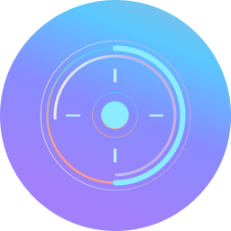
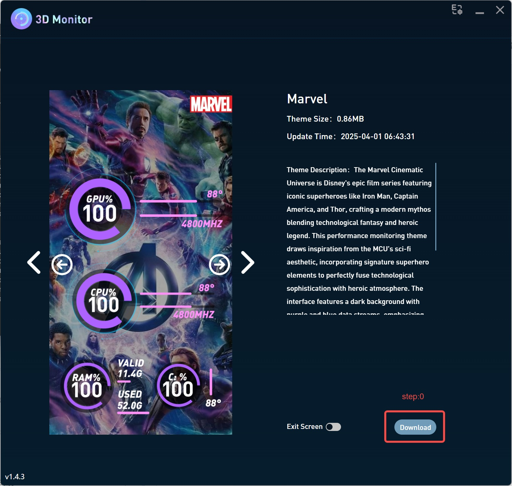
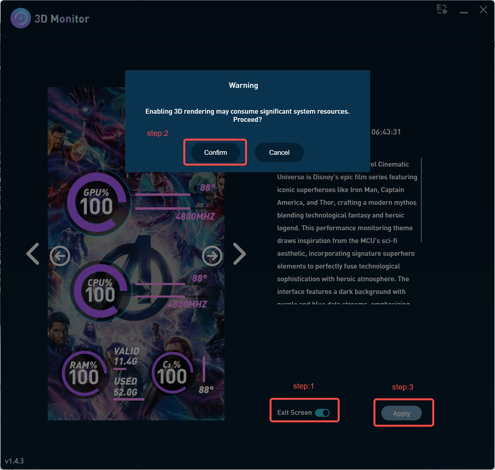
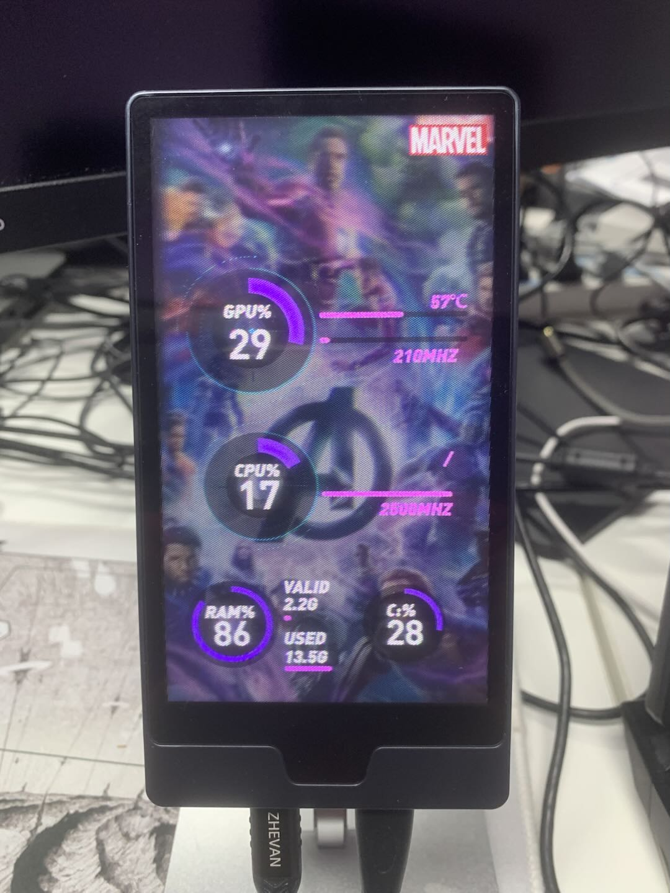
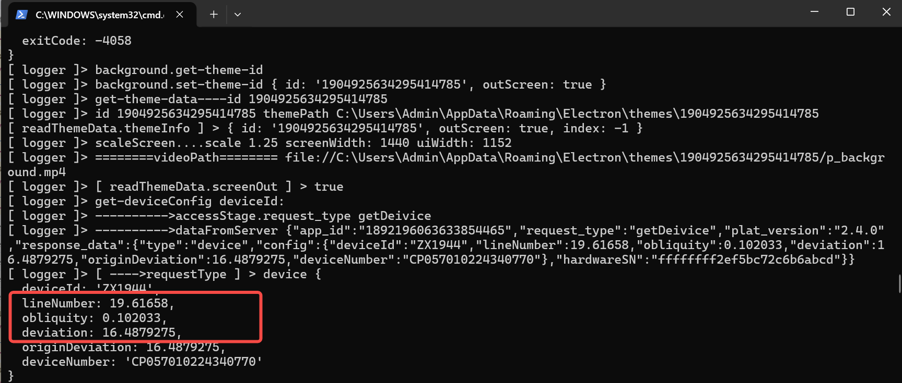

<h4 align="center">
  
  
<h1 align="center">3DMonitor</h1>

</h3>

<p align="center">
    👋 Join our  <a href="https://discord.gg/ZzEhKNJE8g" target="_blank">Discord</a> 
</p>

CubeVi [C1](https://cubevi.com/products/cube-c1) is a glasses-free holographic 3D display. One of the primary goals of this open-source project is to help developers understand how to implement light field rendering on the C1. The C1 uses a lenticular lens array that directs different views to the viewer's left and right eyes simultaneously, producing glasses-free 3D depth without any special eyewear. This project shows how to obtain the grating parameters from the Cubestage or OpenstageAI platform and how to interleave the views.

3DMonitor is an Electron + Vite + Vue 3 desktop application for Windows that renders dynamic, theme-based system dashboards and monitors CPU, GPU, memory, disk and network metrics in real time on the C1 display.

## Key Features

- Renders lenticular-interlaced multi-view imagery for glasses-free 3D playback on the C1 display
- Windows desktop app built with Electron 28, Vite 5, Vue 3 and TypeScript
- Real-time system stats via WMI and systeminformation; NVIDIA GPU via nvidia-smi
- Theme engine driven by JSON layouts and media assets
- Multi-language (English/Chinese) via vue-i18n
- One-click packaging with electron-builder (NSIS installer)

## Requirements

- Windows 10/11 64-bit
- Node.js 18+ and npm 9+
- [Cubestage](https://cubevi.com/pages/download-page) (international / English) or [OpenstageAI](https://www.openstageai.com/download) (Chinese) installed and running on the same machine

## Quick Start

1. Install dependencies

```bash
npm install
```

2. Start in development (launches Vite + Electron)

```bash
npm run dev
```

3. Lint code (optional)

```bash
npm run lint
```

## Build

Production build and package an installer:

```bash
npm run build
```

**Output:** The packaged app is emitted to `release/` (Chinese) or `releaseEn/` (English) at the project root, depending on the `BUILD_LANG` setting.

## Configuration

- `src/api/config/index.ts`
  - `BUILD_LANG`: set to `LANG_EN` or `LANG_CN` to control packaging language
  - `LANGUAGE_SWITCH_ENABLED`: toggle language switch button in UI
  - `LOG_OUTPUT`: enable/disable app logs
  - `getAppName` / `getAppId`: set product name and app ID used by the installer
- `package.json`: update `version` before releases
- `src/background.ts`: set `devTools: false` to disable DevTools in production

## Scripts

| Command | Description |
|---------|-------------|
| `npm run dev` | Start Vite dev server and auto-launch Electron |
| `npm run build` | Build renderer + main/preload and package with electron-builder |
| `npm run lint` | Fix and format supported files |

## Tech Stack

- Electron, Vite, Vue 3, TypeScript, Element Plus, SCSS
- Babylon.js / Three.js for media rendering in viewer components

## Theme Format

A theme folder contains a `data.json` plus images/videos.

`data.json` fields: `id`, `name`, `description`, `cover`, `list`.

`list` is an array of component descriptors:

| Field | Description |
|-------|-------------|
| `type` | One of `text`, `data`, `circle`, `rect`, `vertical`, `image`, `video`, `mask` |
| `category` | Data key (e.g., `cpu-data-temp`, `gpu-circle-usage`) |
| `content` | Text content for `type="text"` |
| `style` | Plain CSS applied to the element |
| `innerStyle` | Component-specific styling |

See [THEME-DEV.md](THEME-DEV.md) for full component examples and the complete category taxonomy.

## How to Use

1. Install [Cubestage](https://cubevi.com/pages/download-page) (international / English) or [OpenstageAI](https://www.openstageai.com/download) (Chinese) and **log in**.

> **Note:** Throughout the rest of this document, **"platform"** refers to either CubeStage or OpenstageAI, whichever you have installed.


2. Run the 3DMonitor app from source:

```bash
npm run dev
```

3. Download a theme.



4. Apply the theme.



5. Enjoy it!



## Grating Parameters

To render correctly, your application must interleave multiple camera views into a single output frame whose pixels are precisely aligned with the physical lens columns. This requires three grating parameters that describe the geometry of the lenticular grid. These values are retrieved at runtime from the **platform** software via a named pipe connection:

| Parameter | Description |
|-----------|-------------|
| **X0** | Horizontal origin offset of the lenticular grid (in subpixels). This is the most critical value and is adjusted per unit during calibration. |
| **Interval** | Pitch of one lenticular lens in subpixels — i.e. how many output pixels wide each lens column is. |
| **Slope** | Tilt angle of the lenticular lens array relative to the pixel grid. Slope is the tangent of this angle. |

### How to Obtain Grating Parameters

In `src/background.ts`, the named pipe response handler shows how the grating parameters are retrieved from the platform service:

```typescript
            log('---------->dataFromServer', respJson)
            let responseData
            let requestType = ''

            const response = JSON.parse(respJson)
            // Compatible with new and old versions: new version uses response.request_type, old version uses response.type
            if (response.request_type) {
                requestType = response.request_type
                responseData = response.response_data
                if(requestType == 'getDeivice'){
                    requestType = responseData.type
                    responseData = responseData.config
                }
            } else {
                requestType = response.type
                responseData = response.config
            }
            log('[ ---->requestType ] >', requestType, responseData)
```



In the above image, **deviation** corresponds to **X0**, **lineNumber** corresponds to **Interval**, and **obliquity** corresponds to **Slope**.

## How to Interleave

Refer to `src/view/viewer/` for the complete interleaving implementation details.

**Conceptual overview**

For every output pixel at position `(x, y)`, compute which lens column it belongs to using X0, Interval and Slope, then determine which sub-view index that column corresponds to, and finally write the correct pixel from that sub-view. The result is a single interleaved frame composited from all parallax views.

The same logic can be ported to any rendering pipeline (WebGL, Three.js, Babylon.js, native OpenGL, etc.).

**End-to-end flow for a new app**

1. Ensure Cubestage or OpenstageAI is running on the same Windows machine.
2. Open a named pipe connection to the **platform** service.
3. Send a `getDeivice` request; the response includes `x0`, `interval` and `slope` inside `response_data.config`.
4. Use those three values to interleave your rendered views before pushing the frame to the C1 display window.

See `src/background.ts` for the exact request/response handling used in this project.

## Light Field Calibration

The lenticular lens grid is manufactured to tight tolerances, but small unit-to-unit variations in lens placement can cause the 3D effect to look misaligned or "ghosted" without fine-tuning. The C1 therefore supports per-unit calibration, performed entirely inside the **platform** — your application does not need to implement any calibration UI of its own.

**What calibration adjusts**

The primary calibration parameter is **X0** — the horizontal origin of the lenticular grid. When X0 is off by even a fraction of a pixel, the left-eye and right-eye views swap or blend incorrectly, degrading the 3D experience. The user adjusts X0 inside the **platform** until the depth effect looks sharp and comfortable, then saves the value to the device.

**What your app needs to do**

Nothing extra. Once the user has calibrated their unit, the corrected X0 (along with the fixed Interval and Slope) is stored on the device and returned automatically to every application that requests device configuration. Simply read the three values at startup and use them directly in your interleaving shader or algorithm — the calibration is already baked in.

> **Tip:** If a user reports that your app's 3D output looks wrong on their device, ask them to re-run calibration in the **platform** first. In most cases that resolves the issue without any code change on your side.

## Publish Your Own App

We warmly welcome developers to build and publish their own apps for the C1 — system dashboards, photo slideshows, generative art, games, data visualizations, educational content, or anything else you can imagine on a glasses-free 3D display.

**How to submit**

Drop a message in the **#engineers-developers** channel on the [CubeVi Discord](https://discord.gg/ZzEhKNJE8g) with a brief description of your app (name, what it does, a screenshot or video if you have one). We will list it manually so that C1 owners can find and install it.

There is no complicated review pipeline — just share what you built and we will take care of the rest. Seeing other users enjoy your creation on their C1 is genuinely exciting, and your work helps grow the entire glasses-free 3D developer community.

## Contributing

Issues and pull requests are welcome. For major changes, please open an issue first to discuss what you would like to change.

## License

This project is licensed under the [Apache License 2.0](LICENSE).

Copyright 2026 CubeVi
